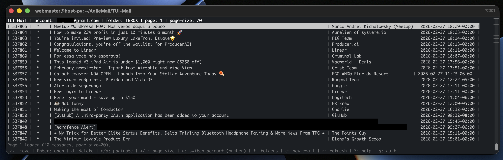

```
 _____ _   _ ___        __  __       _ _
|_   _| | | |_ _|      |  \/  | __ _(_) |
  | | | | | |||}_____ | |\/| |/ _` | | |
  | | | |_| || ||_____|| |  | | (_| | | |
  |_|  \___/|___|      |_|  |_|\__,_|_|_|
```



A Python curses-based terminal UI for browsing and composing emails, powered by [himalaya](https://github.com/pimalaya/himalaya).

## Features

- Browse email envelopes in a scrollable list
- Read, reply, and compose messages
- Switch between folders
- Multi-account support via himalaya configuration
- No external Python dependencies — standard library only

## Requirements

- Python 3.11+
- [himalaya](https://github.com/pimalaya/himalaya) CLI binary installed and configured

## Usage

```bash
python3 tui_mail.py
```

### Options

| Flag | Description |
|------|-------------|
| `--account NAME` | Select a specific email account |
| `--folder NAME` | Start in a specific folder (default: INBOX) |
| `--page-size N` | Number of messages per page |
| `--debug` | Enable debug logging |
| `--debug-log PATH` | Custom debug log file path |
| `--no-mark-seen` | Don't mark messages as read on open |
| `--sender EMAIL` | Override the From header |

## Configuration

TUI-Mail uses himalaya's TOML configuration. Config is searched in order:

1. `$HIMALAYA_CONFIG`
2. `$XDG_CONFIG_HOME/himalaya/config.toml`
3. `~/.config/himalaya/config.toml`
4. `~/.himalaya/config.toml`
5. `~/.himalayarc`

## License

See [LICENSE](LICENSE) for details.
